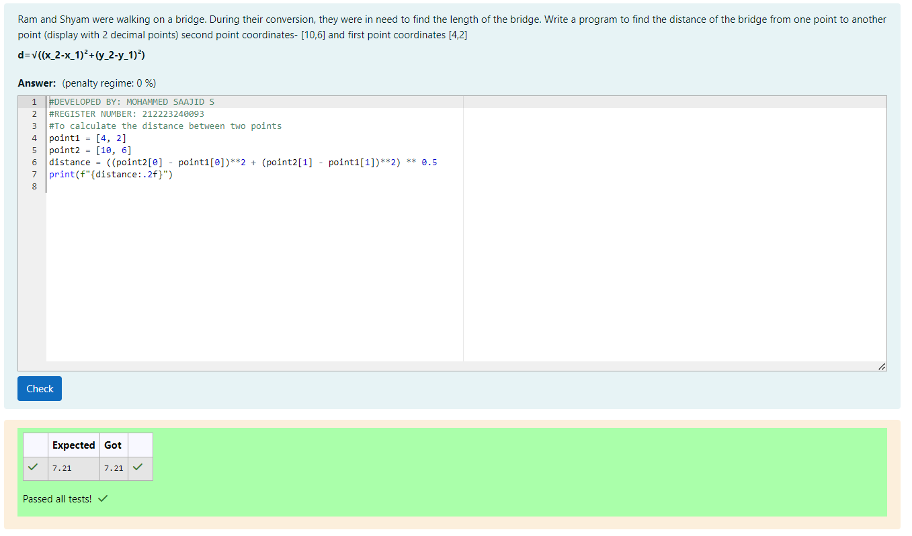

# DISTANCE-BETWEEN-TWO-POINTS

## AIM:
To write a python program to find the distance two 2 points
## ALGORITHM:
### Step 1: 

Using import math function,do the calculations.

### Step 2: 

Take the two coordinates as l1 and l2.

### Step 3: 

Substitute the values in the distance formula


### Step 4: 

Using the print function, display the distance between the two points.

### Step 5: 

End the program.

### PROGRAM:

```

#DEVELOPED BY: MOHAMMED SAAJID S

#REGISTER NUMBER: 212223240093

#To calculate the distance between two points

point1 = [4, 2]

point2 = [10, 6]

distance = ((point2[0] - point1[0])**2 + (point2[1] - point1[1])**2) ** 0.5

print(f"{distance:.2f}")


```
  


### OUTPUT:





### RESULT:

Thus the distance of the two points is sucessfully executed and displayed.
